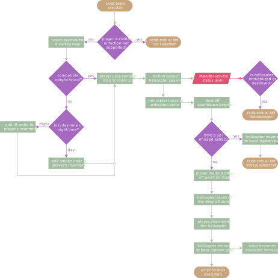

  

Synopsis
========
This is my neat little helicopter extraction script for Arma III. What makes this script different than any other extraction script ever released for the Arma series is that it applies a bit more realism and complexity. It's unique in a sense that:

* It detects if you have compatible magazines (throwable and 40mm launchable) and will let you use them to mark the LZ. If not, the script will give you a throwable smoke grenade or IR strobe depending on whether it's day or night time.

* The helicopter is completely dependent on the player's faction and side.

* The spawn position of the helicopter is random. It can arrive from any direction.

* After the helicopter lands at the extraction zone, it will not wait forever to be boarded. Instead, there is a countdown timer that you have to board the helicopter before it zeros out. Othwerwise, the helicopter will RTB.

* Helicopter and crew invincibility is optional (enabled by default; can be changed by modifying the script). Disabling invincibility can put the helicopter at risk of getting shot down. If that happens, the player will be notified that it has been destroyed. You will not be able to request another one, however.

Here's a quick rundown of the script:

  

Multiplayer Support
-------------------
The script has never been tested in an online environment and will most likely not work on as-is basis since it was not designed with multiplayer in mind. I also do not play Arma online, so I will not be working on this personally. If you run a server and/or know what you're doing, go ahead and tinker with the script all you want. Feel free to contribute your code to this project.

CUP & RHS Support
-----------------
Support for Community Upgrade Project and Red Hammer Studios mods is included. If the script detects that your player unit belongs to a CUP or RHS faction, the extraction helicopter will be part of the said faction.

The support goes beyond non-vanilla helicopters. Since RHS units carry custom magazines, support for mod's-exclusive throwable grenades is also included. The script will also let you use your 40mm underbarrel grenade launcher, such as M203 and GP-25, from both mods to mark the landing zone.

ACE Compatibility
-----------------
The compatibility status with Advanced Combat Environment 3 (ACE 3) mod is unknown as of 27/7/2019. This script may or may not fucntion properly when ACE is active.

Usage
-----
This should be fairly easy for anyone to do.

1. Copy the content of `\src\` to your missions folder at `\Documents\Arma 3\missions\<missionName>`
2. Launch your mission and dial 0-0-1. The script will execute. Follow its given on-screen instructions. Voila!

Note: `init.sqf` creates the Trigger object that is used to execute the script via radio slot 1 (ALPHA). If you need the slot for something else, you can change it to whatever you wish. See [/wiki/setTriggerActivation](https://community.bistudio.com/wiki/setTriggerActivation) for other slot choices.

Legal
-----
This project is distributed under the terms of the [MIT License](LICENSE).
